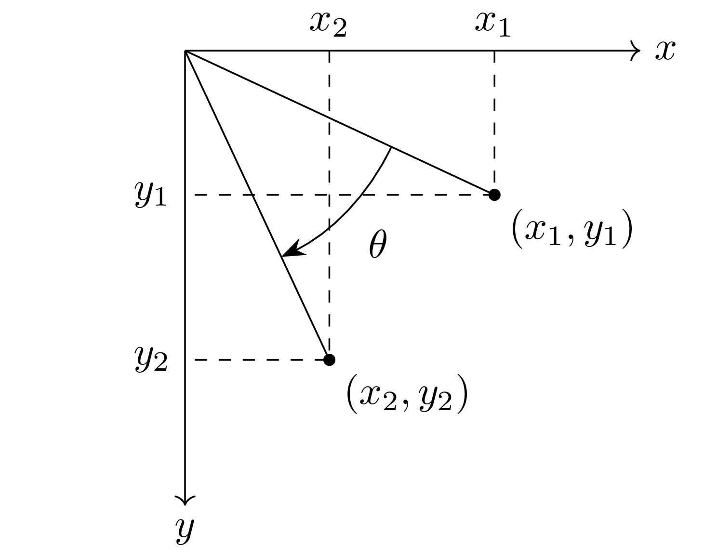

# latex-assets

This is a repository for storing TikZ code for creating diagrams.

## Sample

### Digital Coordinate

https://github.com/lin-ion/latex-assets/blob/5fd2cd489c12df5b9d7fe9312d4846630b37a1cb/tikz/digital_coordinate.tex#L1-L29