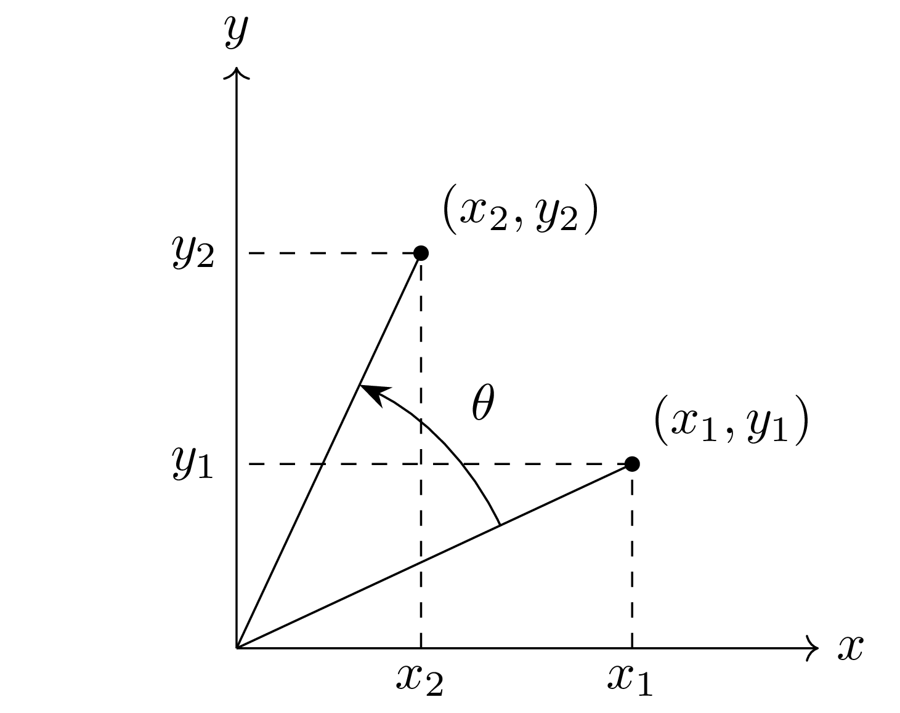
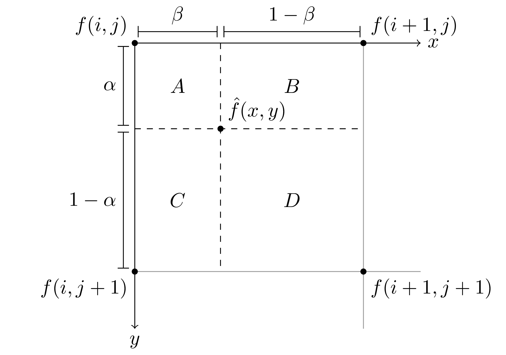

# latex-assets

This is a repository for storing TikZ code for creating diagrams.

## Sample

<https://github.com/lin-ion/latex-assets/blob/5fd2cd489c12df5b9d7fe9312d4846630b37a1cb/tikz/digital_coordinate.tex#L1-L29>

<table><tr><td>Cartesian Coordinate System</td><td>Digital Coordinate System</td></tr><tr><td>
</td><td>
</td><td>
<tr><td>Bilinear Interpolation</td><td>placeholder</td></tr><tr><td>
</td><td>
</td></tr>
</table>
